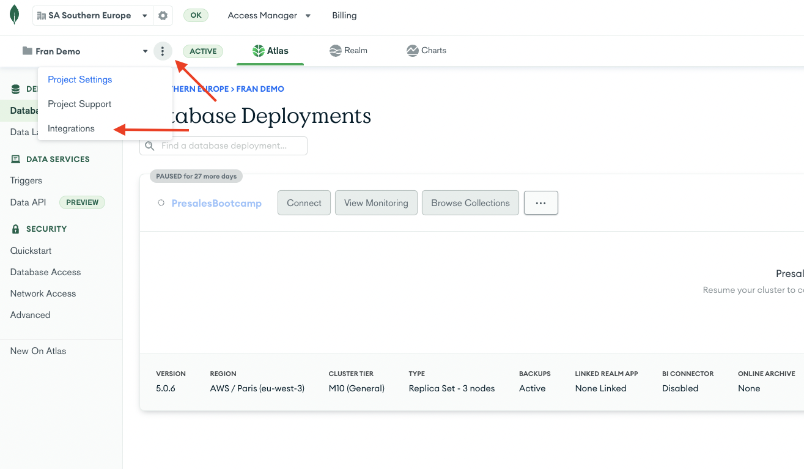
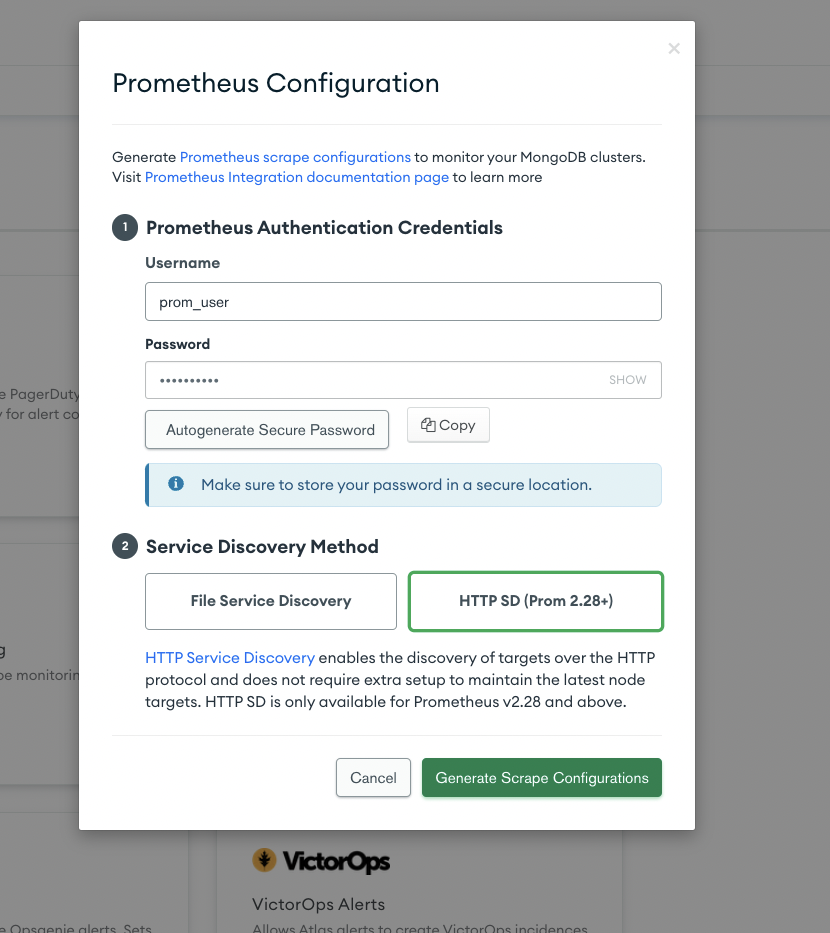
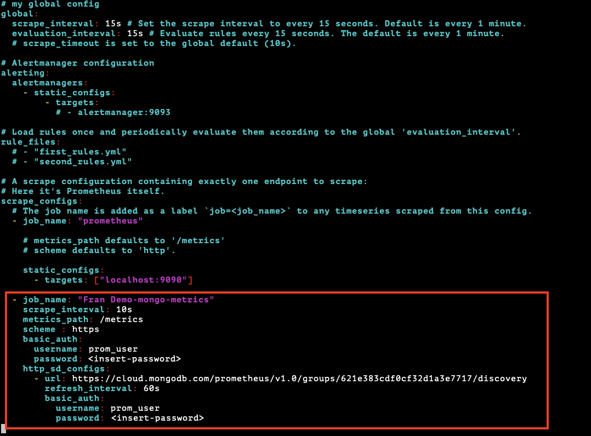
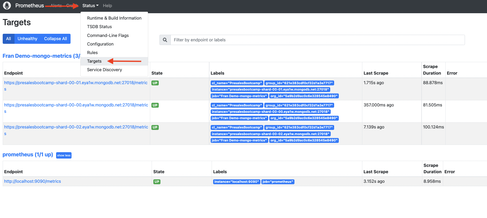
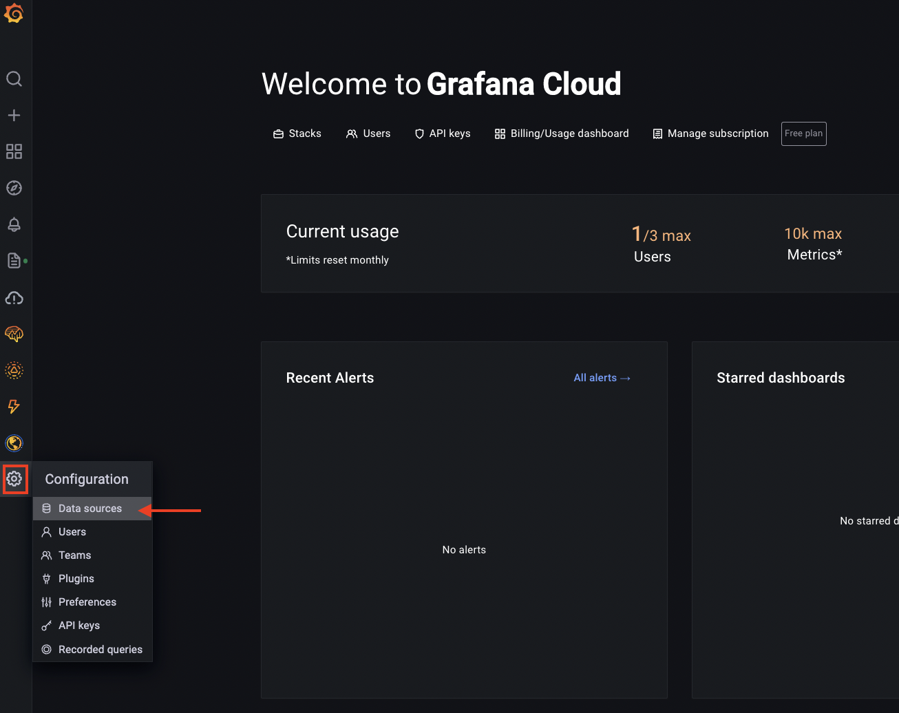
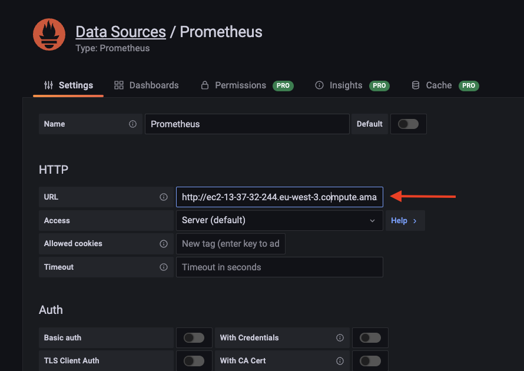
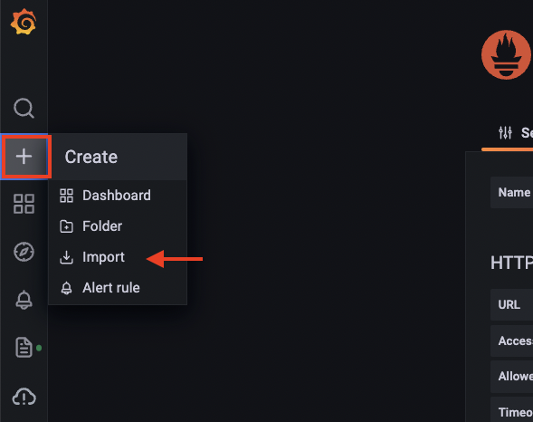
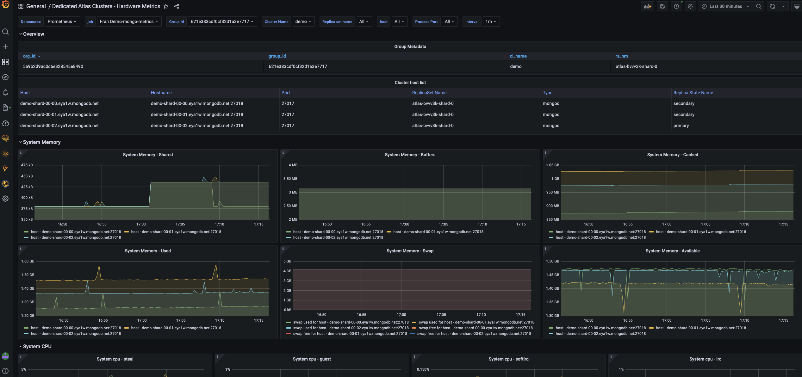
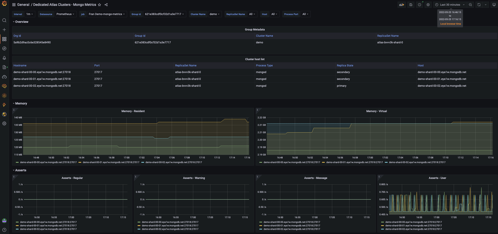

# ATLAS-PROMETHEUS-GRAFANA INTEGRATION

__Ability to integrate Atlas metics into Prometheus and chart them using Grafana__

__SA Maintainer__: [Francisco Royo](mailto:francisco.royo@mongodb.com) <br/>
__Time to setup__: 15 mins <br/>
__Time to execute__: 30 mins <br/>

---
## Description

This proof shows how MongoDB Atlas monitoring metrics can be ingested into a Prometheus server through Atlas-Prometheus native integration and how to create dashboards in Grafana to visualize them.

---
## Setup
__1. Create a Grafana Cloud account__

* Sign up for a new free account in https://grafana.com/auth/sign-up/create-user?plcmt=sub-nav

__2. Configure Atlas Environment__

* Log-on to your [Atlas account](http://cloud.mongodb.com) and navigate to your project
* Ensure you have at least one Atlas Cluster running or create a new __M10__ one with default specifications 

__3. Configure AWS Environment__
* Using your MongoDB 'Solution Architects' [AWS pre-existing account](https://wiki.corp.mongodb.com/display/10GEN/SA+AWS+Access+-+Updated+Nov+2020), log on to the __AWS console__ and near the top right hand side of the AWS Console, __change the region__ to match the same AWS region as you created the Atlas cluster in
* Launch (create) a new EC2 instance with the following settings (use defaults settings for the rest of the fields):
  * __AMI Type__: Amazon Linux 2 AMI (HVM), SSD Volume Type
  * __Instance Type__: t2.medium
  * __Add Tags__: be sure to set the 3 specific tags ('name', 'owner', 'expire-on','purpose') on your instance as per the [MongoDB AWS Usage Guidelines](https://wiki.corp.mongodb.com/display/DEVOPSP/AWS+Reaping+Policies) to avoid your instance from being prematurely reaped
  * __Security Group__: create a new security group which has an inbound rule to allow SSH only on port 22 and TCP on port 9090 from source 0.0.0.0/0
* When prompted, choose to use your existing key pair or create a new key pair (typically named similar to 'firstname.lastname'). If creating a new key pair, be sure to click the button to __Download Key Pair__ and store the key somewhere safe on your laptop.
*  Once the AWS instance is running, find it in the AWS Console __instances__ list, select it, and in the description section near the bottom of the AWS Console locate the __IPv4 Public IP__ field and make a note of its value
* Now go to the __Atlas Console__ and in the Security tab, add a new __IP Whitelist__ entry for the IP address you just captured, to allow the AWS instance to connect to your Atlas cluster. Ensure 0.0.0.0/0 is __NOT__ whitelisted since this is a requirement for configuring the Atlas-Prometheus integration

---
## Execution

__1. Enable Atlas-Prometheus integration__
* In Atlas UI go to Project -> Integrations:



* Select Prometheus
* Set a username, password, select HTTP SD and click Generate Scrape Configuration:



Copy the generated snippet. We will use it to configure prometheus server later

__2. Install, configure en start Prometheus server in your AWS EC2 instance__
* In the AWS Console __instances__ list select your AWS instance, press the __Connect button__ and follow the instructions to SSH into this instance from a new terminal window on your laptop
* Go to [Prometheus Downloads page](https://prometheus.io/download/) and copy the link for the latest Prometheus release
* In the previous SSH terminal session, run the following commands to download and extract Prometheus server:

  ```bash
  wget https://github.com/prometheus/prometheus/releases/download/v2.35.0-rc0/prometheus-2.35.0-rc0.linux-amd64.tar.gz
  tar -xzvf prometheus-2.35.0-rc0.linux-amd64.tar.gz
  cd prometheus-2.35.0-rc0.linux-amd64
  ```
  __Note__ change the URL in the wget command for the proper one you just copied in the previous step and the version number in the tar and cd commands to the ones that matches with your download
* Edit prometheus.yml and add the snippet copied from the previous step in the  “scrape_configs:” section:



Set the proper value for the password fields
* Start Prometheus server by executing:
  ```bash
  nohup ./prometheus > prometheus.log &
  ```
* Check that Prometheus is successfully scrapping metrics from Atlas:
  * Open Prometheus web UI (http://your_EC2_instance_ip_address:9090/) 
  * Click on Status -> Targets and check all end points related to your Altas project are in UP state:
  
  

__3. Connect Grafana to Prometheus__
* Open your Grafana Cloud account and go to Configration -> Datasources:



* Click on Add Datasource
* Click on Prometheus Datasource and configure URL to http://your_EC2_instance_ip_address:9090:



* Click save and test

__4. Import some sample dashboards__
* In the Grafana UI click on + -> import



* Click on upload JSON file
* Select the JSON fille: you can use the following templates:
  * Dashboard with Hardware metrics: [Hardware metrics](dashboardTemplates/HardwareMetrics.json)
  * Dashboard with MongoDB metrics: [Mongo metrics](dashboardTemplates/MongoMetrics.json)
* Click import

---
## Measurement

After importing the previous dashboards, they will appear in Grafana's dashboard section and thet will look like:




